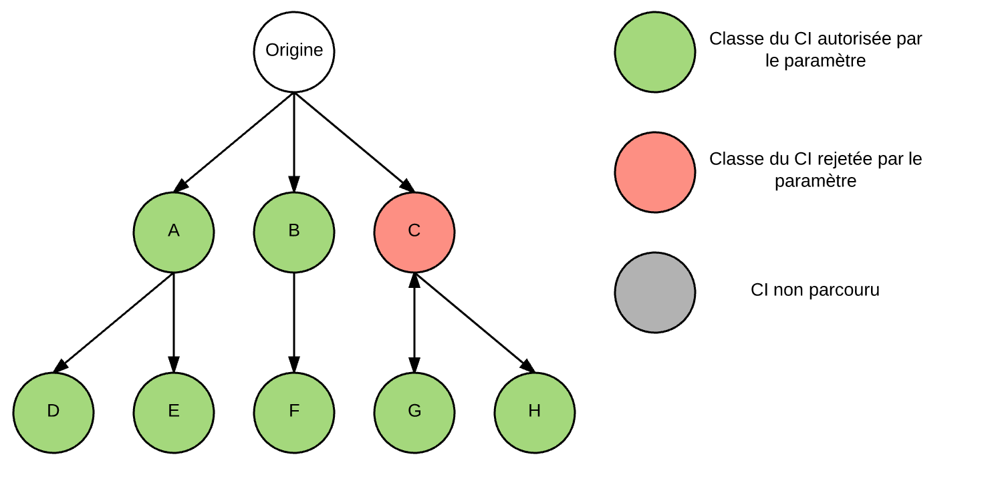

# CIRelationshipsTools

## Description

Cette classe permet de retrouver la liste des CIs en relation avec un CI donné ainsi que de générer des filtres pour Reference Qualifier.

> Pour le moment, la classe ne permet que de trouver un CI avec un filtrage sur le CI relié, il est prévu à moyen terme d'ajouter des possibilités de filtrage plus poussées comme les relations.

## Attributs

<a name="_optionsTemplate"></a>**_optionsTemplate** : *Static*
Stock les templates d'options au sein même de la classe. Un template est sélectionnable à l'instanciation de la classe. Implémente un algorithme de parcours en largeur d'arbre orienté.

<a name="defaultMaxDepth"></a>**defaultMaxDepth**
Profondeur maximale à explorer dans l'arbre des relations par défaut.

<a name="ci"></a>**ci**
Identifiant système du CI racine de l'arbre de recherche.

<a name="options"></a>**options**
Contient les options de l'instance.

## Méthodes

Liste des méthodes :

 - [CIRelationshipsTools](#CIRelationshipsTools) : Constructeur
 - [getRelatedCI](#getRelatedCI) : Recherche des CIs reliés
 - [getRelatedCIFilter](#getRelatedCIFilter) : Recherche des CIs reliés
 
<a name="CIRelationshipsTools"></a>**CIRelationshipsTools(ciSysID,options)**
Entrée : 
 - **ciSysID** : *String* : Identifiant système d'un élément de configuration
 - **options** : *Object* : Contient le [paramétrage](#options) de la recherche
Sortie :
 - *Void*

<a name="getRelatedCI"></a>**getRelatedCI(maxDepth, childToParent)**
Entrée :
 - **maxDepth** : *Number* : Profondeur maximale à parcourir dans l'arbre. Si inférieur à 0, ou que la valeur n'est pas un nombre, [defaultMaxDepth](#defaultMaxDepth) sera utilisé.
 - **childToParent** : *Boolean* : Paramètre optionnel. Si faux ou non renseigné, le comportement standards sera utilisé (parent -> enfant dans la logique des relations entre CIs dans ServiceNow). Si le paramètre est vrai, l'algorithme utilisera les relations dans le sens enfant -> parent.
Sortie : 
 - *Array* : Liste d'identifiants système correspondants aux CIs trouvés lors de la recherche.

<a name="getRelatedCIFilter"></a>**getRelatedCIFilter(maxDepth, childToParent)**
Entrée :
 - **maxDepth** : *Number* : Profondeur maximale à parcourir dans l'arbre. Si inférieur à 0, ou que la valeur n'est pas un nombre, [defaultMaxDepth](#defaultMaxDepth) sera utilisé.
 - **childToParent** : *Boolean* : Paramètre optionnel. Si faux ou non renseigné, le comportement standards sera utilisé (parent -> enfant dans la logique des relations entre CIs dans ServiceNow). Si le paramètre est vrai, l'algorithme utilisera les relations dans le sens enfant -> parent.
Sortie : 
 - *String* : Requête encodée sous le format "sys_idIN\<sys_id1\>\<sys_id2\>...\<sys_idn\>"

----------
## <a name="options"></a>Options

Cette classe propose plusieurs paramètres permettant le filtrage des éléments de configuration et influençant le déroulement de l'algorithme.
Il existe deux types de paramètres, ceux agissant comme un filtre sur le GlideRecord récupérant les enfants (d'un point de vue arbre) d'un CI et ceux agissant indépendant de la requête au serveur et lors de la boucle de parcours des résultats. Ainsi, filtrer un CI avec le premier type de filtre reviendra à élaguer toute une branche de l'arbre tandis qu'un filtre du second type pourrai ou non élaguer la branche correspondant aux enfants du CI. Pour ces filtre, le comportement est détaillé dans leur description.

Liste des options : 

 - [authClass](#authClass)
 - [prohClass](#prohClass)
 - [filterCI](#filterCI)
 - [stopClass](#stopClass)
 - [encodedQuery](#encodedQuery)
 - [allCI](#allCI)

----------

<a name="authClass"></a>**authClass** : *Array* : Action après le GlideRecord.
Liste des classes de CI à autoriser dans le résultat. Si un CI est rejeté par ce filtre, ces enfants seront tout de même parcourus.



<a name="prohClass"></a>**prohClass** : *Array* : Action après le GlideRecord.
Liste des classes de CI à ne pas autoriser dans le résultat. Si un CI est rejeté par ce filtre, ces enfants seront tout de même parcourus. 
!!! Si l'option **[authClass](#authClass)** est utilisée, **prohClass** ne sera pas considérée.

<a name="filterCI"></a>**filterCI** : *Function* :  Action après le glide record.
Fonction de filtrage "libre". Peut accepter un paramètre en entrée correspondant à un GlideRecord de CI. Doit obligatoirement renvoyer un *Array* de deux *boolean*:
[bool1,bool2] :
 - bool1 : Indique si le CI est à intégrer au résultat
 - bool2 : Indique si la recherche dans cette branche de l'arbre doit se poursuivre
> Exemple de fonction :
> ```javascript
>  function(curr){
>  return [curr.u_active==true,true];
> }```
> Dans ce cas, le CI n'apparaitra dans les résultat que si le champ u_active est true et ses enfants seront parcourus quoiqu'il arrive.

<a name="stopClass"></a>**stopClass** : *Array* :  Action après le glide record.
Liste des classes de CI servant de points d'arrêt à la recherche, si un CI avec l'une des classes renseignées est fourni, il sera intégré au résultat mais sa branche ne sera pas parcourus.


<a name="encodedQuery"></a>**encodedQuery** : *String* :  Action pendant le glide record.
Requête encodée au format ServiceNow. Tout CI écarté par ce paramètre ne sera pas intégré au résultat et sa branche ne sera parcouru.
> Note : Le Dot-Walking est possible dans les requêtes encodées.


<a name="allCI"></a>**allCI** : *String*.
Requête encodée utilisée comme filtre lorsque qu'aucun résultat ne sort de la recherche avec les autres paramètres.
> Note : Le Dot-Walking est possible dans les requêtes encodées.
